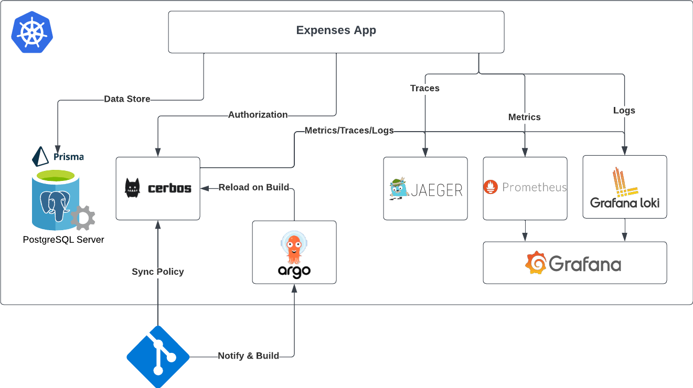

# Demo Expenses Application

## Architecture




## Getting Started

### Start Infra (Cerbos, Postgres, Promethesus, Jeager, Grafana)
```
docker-compose -f infra/docker/docker-compose.dev.yaml up --build
```

### Start Server
```
cd server
npm install
npm run dev
```

### Start Client
```
cd client
npm install
npm run dev
```

